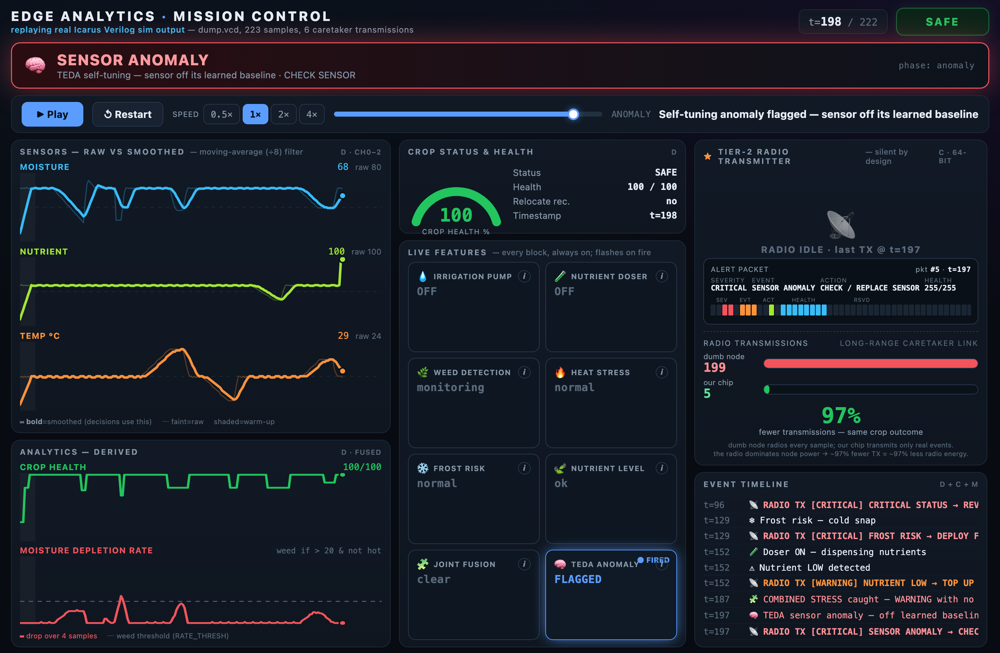
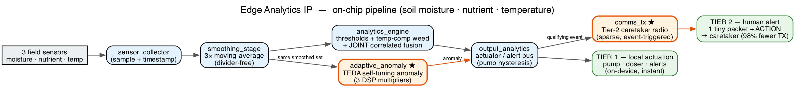
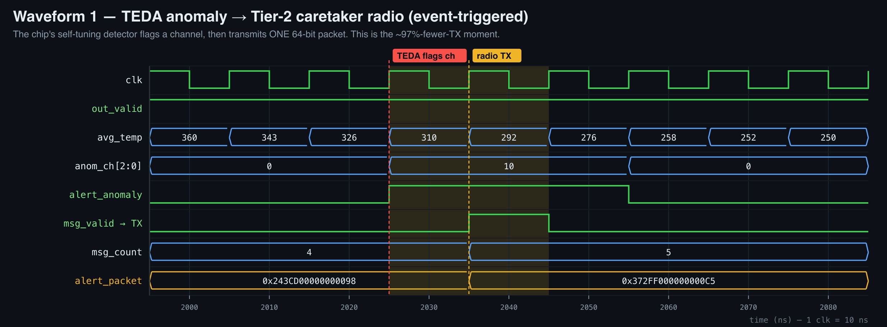
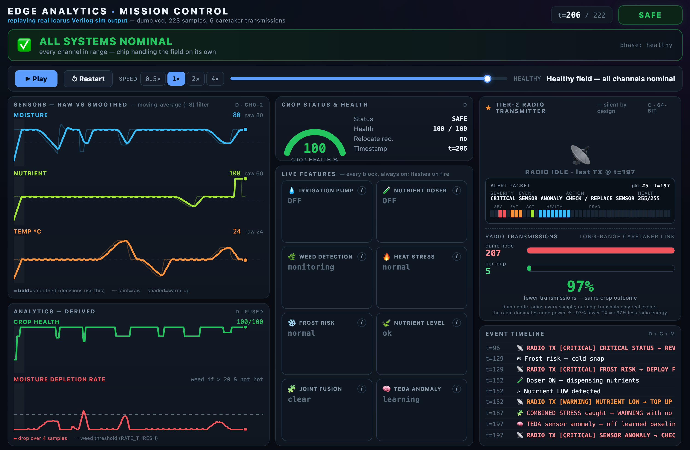

# 🌱 Edge Analytics IP — a self-tuning sensor-analytics chip for Precision Agriculture

**Edge analytics in silicon, not the cloud.** A synthesizable Verilog IP core that reads
field sensors, smooths the noise, decides what's wrong, and **acts on-device in
microseconds** — watering the crop, catching resource-stealing weeds, shrugging off broken
sensors — and stays radio-silent, alerting a human **only when one is truly needed**.

> **ROBOCHIPX '26 · Problem #5 (Edge Analytics IP)** · SDG 9 & 11 · Verilog RTL, proven by
> simulation + Yosys synthesis. Hardware fabrication not required.

<p align="center">
  
  <br/>
  <em>Mission Control — replaying the <b>real</b> 223-sample simulation. Here the self-tuning
  TEDA detector flags a sensor off its learned baseline and the Tier-2 radio transmits one
  packet. <b>6 alerts vs 223 samples → ~97% fewer transmissions.</b></em>
</p>

---

## Why it's different

Most "smart farm" projects run Python on a Raspberry Pi or ship every reading to the cloud.
This is a **dedicated chip** that does the analytics itself. Four things set it apart:

| # | Differentiator | Why it matters |
|---|---|---|
| ① | **TEDA self-tuning anomaly** — the chip *learns each field's own "normal"* (running mean + variance, Chebyshev bound, **divider-free**) | No hand-tuned thresholds → scales to thousands of varied nodes |
| ② | **Joint / correlated fusion** — reasons about sensor *combinations*, not one channel at a time | Catches "combined stress" that single thresholds miss |
| ③ | **Two-tier triage** — Tier-1 acts locally (pump/doser); Tier-2 stays **silent** and radios one tiny alert only on a real event | **~97% fewer transmissions** (6 vs 223) → battery life at the edge |
| ④ | **It's real silicon** — synthesizable RTL, verified in simulation, synthesized with Yosys | ~6% of an Artix-7 FPGA; 3 DSP blocks = the anomaly multipliers |

---

## What it does

A full **detect → decide → act** loop, entirely on-device:

| Detects | Automatic response | Signal |
|---|---|---|
| Dry soil | Irrigation pump ON (with hysteresis — never chatters) | `pump_on` |
| Resource-stealing **weed** | Alert — abnormal moisture-depletion rate, temperature-compensated so a hot day isn't a false alarm | `alert_weed` |
| Low nutrients | Fertilizer doser / alert | `dose_nutrient` |
| Heat / frost | Climate-protection alerts | `alert_heat` / `alert_frost` |
| Faulty sensor | TEDA flags it, chip keeps running | `alert_anomaly` |
| Overall crop health | SAFE / WARNING / CRITICAL + fused score | `status`, `crop_health` |
| A human is truly needed | One 64-bit packet on the long-range radio | `comms_tx` (Tier-2) |

---

## Architecture

<p align="center">
  
</p>

```
 sensors → sensor_collector → smoothing_stage → ┬─ analytics_engine (thresholds + weed + fusion) ─┬→ output_analytics ─┬→ TIER 1  pump · doser (on-device, instant)
 (moisture ·           (sample +      (3× moving-  └─ adaptive_anomaly ★ (TEDA self-tuning) ─────────┘   (pump hyst.)     └→ TIER 2  comms_tx ★ → 1 packet → caretaker radio
  nutrient · temp)      timestamp)     average)                                                                                          (sparse, event-triggered)
```

★ = the two differentiator blocks. Everything is a latency-aligned pipeline; the pump is a
2-state hysteresis FSM (200…350 band) so it never oscillates.

---

## Proof it's real silicon

**Verified cycle-by-cycle** (waveform from the actual `dump.vcd`) and **synthesized** (Yosys):

<p align="center">
  
  <br/>
  <em>The anomaly detector fires and the radio transmits exactly one 64-bit packet, on the
  right clock edge.</em>
</p>

| Metric | Value |
|---|---|
| Caretaker transmissions | **6 packets vs 223 samples → ~97% fewer** |
| FPGA utilization (Artix-7 xc7a35t) | **~1,245 LUTs · 1,163 FFs · 3 DSP48 · ~6% of the chip** |
| Verification | 223-sample story trace, per-module testbenches — **PASS, 0 errors** |
| Timing / power | *Not quoted — needs Vivado place-and-route, which was not run (would be fabricated).* |

> The 3 DSP blocks are the TEDA anomaly multipliers (one per channel). Full reports and
> reproducible commands in [`edge_analytics/synthesis/`](edge_analytics/synthesis/).

---

## The live demo — Mission Control

A self-contained dashboard that replays the **real** simulation output (no fake data). It
shows all 3 sensors (raw vs smoothed), the derived analytics, every feature as a live tile,
the Tier-2 radio, and a "dumb node vs our chip" transmission race that ends at **223 vs 6**.

<p align="center">
  
  <br/>
  <em>The full run: crop health recovered to 100, every feature exercised, and the honest
  <b>97%</b> settled on the radio panel.</em>
</p>

```bash
# just open it in a browser — it's self-contained
open edge_analytics/demo/mission_control.html
# tip: ?frame=198 deep-links a specific frame (used for these screenshots)
```

---

## Quick start (simulation)

Requires [Icarus Verilog](http://iverilog.icarus.com/) — `brew install icarus-verilog`.

```bash
cd edge_analytics

# compile the whole chip + its top-level story-trace testbench
iverilog -o simulation.vvp edge_analytics_top.v sensor_collector.v smoothing_stage.v \
  moving_avg.v analytics_engine.v output_analytics.v adaptive_anomaly.v comms_tx.v \
  edge_analytics_tb.v

# run it — prints the D/E/C/M stream + "RESULT: PASS ... 0 errors", dumps dump.vcd
vvp simulation.vvp

# any single module with its own testbench, e.g.:
iverilog -o m.vvp analytics_engine.v analytics_engine_tb.v && vvp m.vvp
```

Regenerate the synthesis + waveform artifacts:

```bash
# waveforms (pure-Python, no gtkwave needed) → synthesis/*.svg + *.png
python3 synthesis/render_waveforms.py
# synthesis (needs yosys) — see synthesis/SYNTHESIS_REPORT.md for the exact flow
```

---

## Repository layout

```
edge_analytics/
├── *.v                       # 8 synthesizable modules + a testbench each
├── edge_analytics_top.v      #   top-level integration (+ warm-up gate)
├── edge_analytics_tb.v       #   223-sample story-trace, self-checking
├── demo/
│   ├── mission_control.html  # the live dashboard (self-contained)
│   ├── mission_control_data.txt
│   └── screenshots/          # dashboard captures used in this README
├── synthesis/
│   ├── SYNTHESIS_REPORT.md   # Yosys flow + reproducible commands + honesty note
│   ├── architecture.{svg,png}          # clean block diagram
│   ├── waveform_*.{svg,png}            # cycle-by-cycle proof (from dump.vcd)
│   ├── fsm_pump.{svg,png}              # pump-hysteresis state machine
│   ├── schematic_top_block*.{svg,png}  # Yosys netlist
│   └── render_waveforms.py             # VCD → SVG renderer
├── presentation/             # day-of kit: cheat sheet, slide images, checklist
├── docs/                     # problem spec, interface contract, plan, changelog
└── papers/                   # literature the design choices are grounded in
```

---

## Modules — all built, integrated, verified ✅

| Module | Feature | Status |
|---|---|---|
| `sensor_collector` | Sample collection + timestamps | ✅ |
| `smoothing_stage` (`moving_avg` ×3) | Divider-free moving-average filter | ✅ |
| `analytics_engine` | Thresholds + temp-compensated weed + **joint fusion** | ✅ |
| `output_analytics` | Actuators + alerts + pump hysteresis FSM | ✅ |
| `adaptive_anomaly` ★ | **TEDA self-tuning anomaly** (3 DSP) | ✅ |
| `comms_tx` ★ | **Tier-2 caretaker radio** (sparse, event-triggered) | ✅ |
| `edge_analytics_top` | Integration + warm-up gate | ✅ |

---

## Research grounding

Design choices trace to published work, and the agronomic thresholds are real and cited:

- **Lozoya et al. 2021** (*Sensors*) — event-triggered irrigation (~20% power) → *the Tier-2 sparse-transmission idea.*
- **Angelov — TEDA** (Typicality & Eccentricity Data Analytics) → *the self-tuning anomaly algorithm, put in silicon.*
- **FAO-56** (crop coefficients / depletion) + **USDA NRCS** (soil water capacity) → moisture/NPK setpoints for 4 crops × 3 soils, in [`docs/CROP_PROFILE_DATA.md`](edge_analytics/docs/CROP_PROFILE_DATA.md).

---

## Deliverable note

Per Problem #5, the deliverable is **synthesizable Verilog RTL proven by simulation + test
results** — no board bring-up required. This repo adds Yosys synthesis (utilization +
schematics) and cycle-by-cycle waveforms as extra proof. No Fmax/power figures are quoted,
because those require place-and-route (Vivado/Quartus) which was not run.
